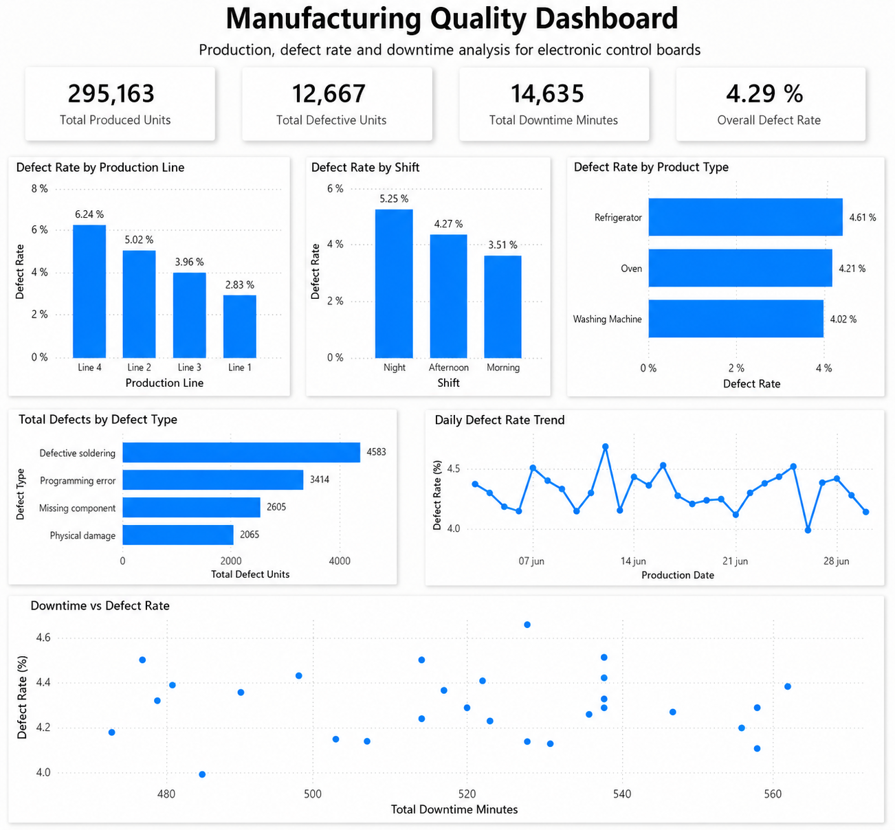
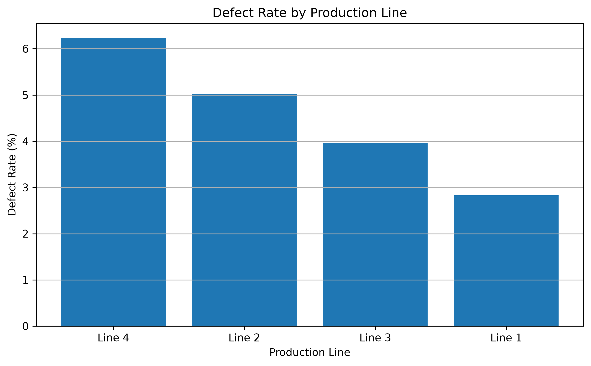
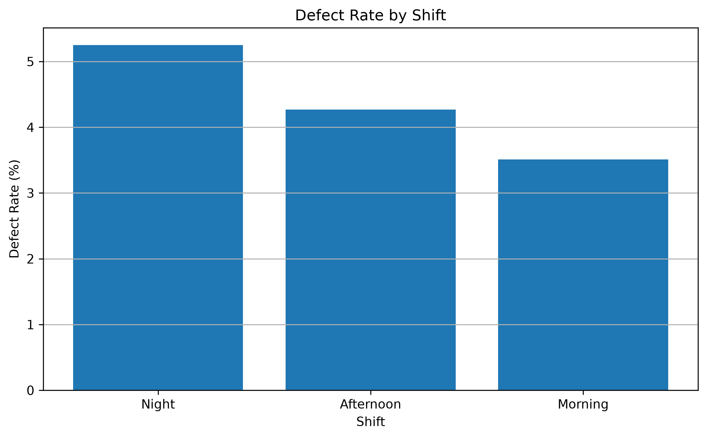
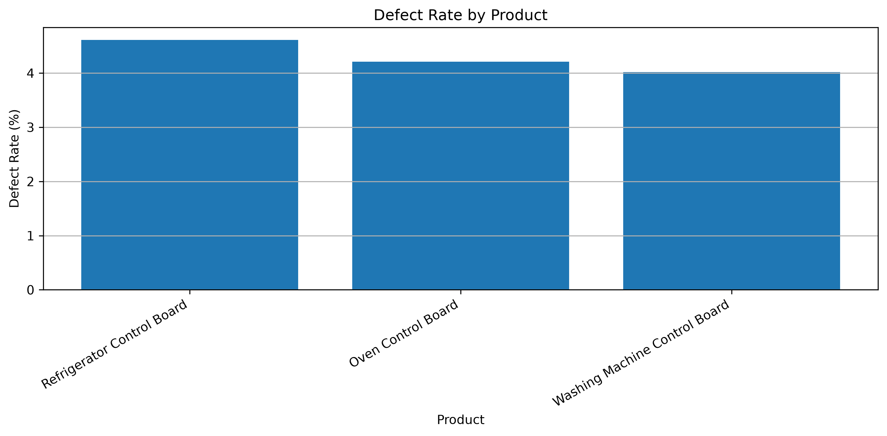
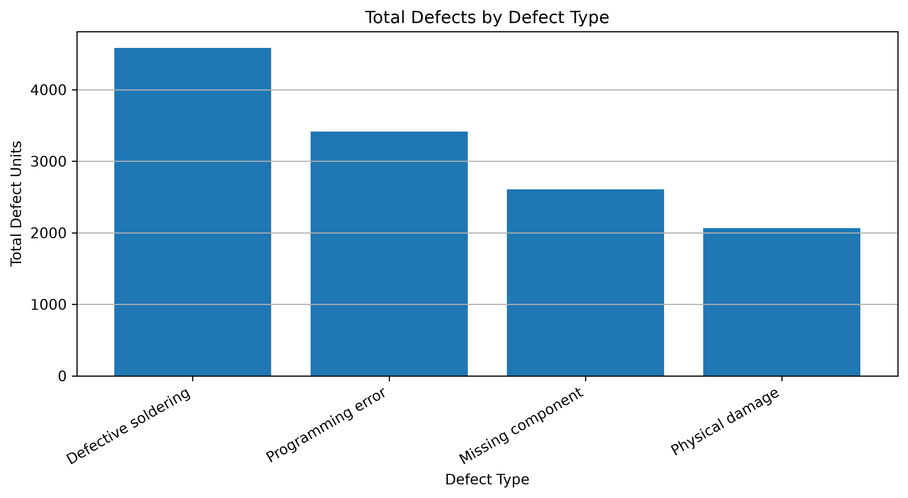
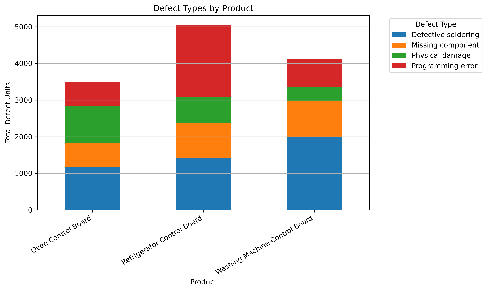
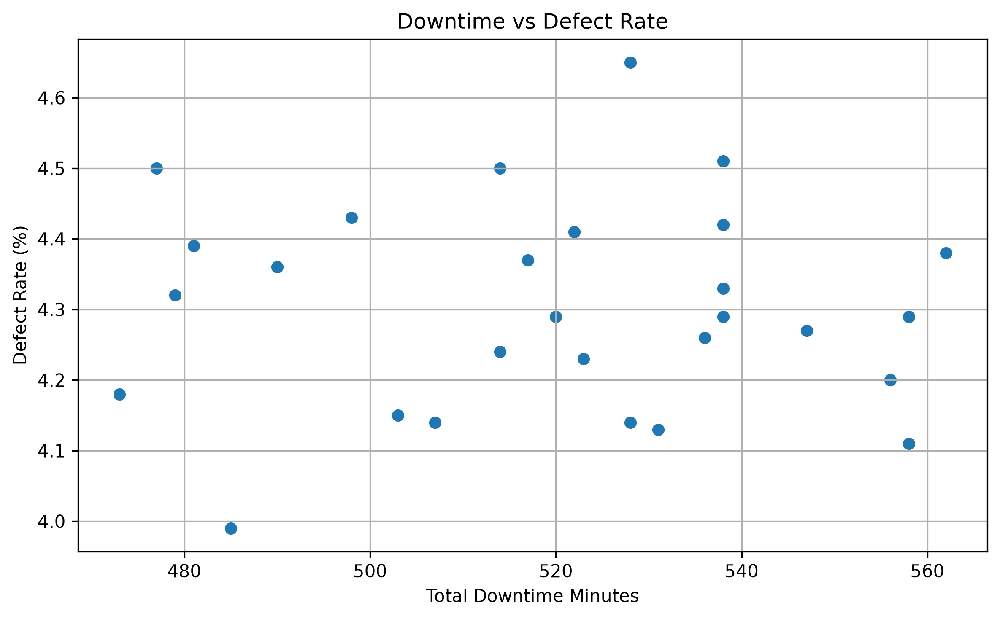

# Manufacturing Quality & Production Dashboard

## Project Overview

This project analyzes simulated manufacturing production data for electronic control boards used in home appliances.

The goal is to identify production lines, shifts, products and defect types with the highest quality and operational issues. The analysis combines a relational SQLite database, SQL business queries, Python, Pandas and Matplotlib visualizations.

The project is designed as a portfolio case study for data analysis and business intelligence.

## Business Problem

A manufacturing plant produces electronic control boards for different appliances. Management wants to understand why some production lines, shifts and products show higher defect rates and downtime.

The analysis focuses on answering:

* Which production line has the highest defect rate?
* Which shift has the worst quality performance?
* Which product has the highest defect rate?
* What are the most common defect types?
* Are downtime and defect rate strongly related?
* What improvement actions should be prioritized?

## Tools Used

* SQL
* SQLite
* DB Browser for SQLite
* Python
* Pandas
* Matplotlib
* Jupyter Notebook
* Git and GitHub

## Database Structure

The project uses a relational database with the following tables:

* `production_records`
* `production_lines`
* `shifts`
* `products`
* `defect_types`
* `defect_records`

Main relationships:

* One production line can have many production records.
* One shift can have many production records.
* One product can have many production records.
* One production record can have many defect records.
* One defect type can appear in many defect records.

## Dataset

The dataset was generated with Python to simulate realistic manufacturing behavior.

It includes:

* 338 production records
* 295,163 produced units
* 12,667 defective units
* 14,635 downtime minutes
* 4 production lines
* 3 shifts
* 3 product types
* 4 defect categories

## Key KPIs

| KPI                      |   Value |
| ------------------------ | ------: |
| Total produced units     | 295,163 |
| Total defective units    |  12,667 |
| Overall defect rate      |   4.29% |
| Total downtime minutes   |  14,635 |
| Total production records |     338 |

## Power BI Dashboard

An interactive Power BI dashboard was created to visualize the main manufacturing quality KPIs and insights.



## Key Findings

### Production Line Performance

Line 4 had the highest defect rate at 6.24%, making it the worst-performing production line in proportional quality.

Line 2 had the highest total number of defective units, while Line 3 had the highest accumulated downtime.



### Shift Performance

Night shift had the highest defect rate and the highest downtime, making it the worst-performing shift.

Morning shift showed the best performance, with the lowest defect rate and more stable operations.



### Product Performance

Refrigerator Control Board had the highest product-level defect rate.

Although product defect rates were relatively close, Refrigerator Control Board showed the worst proportional quality performance.



### Defect Type Analysis

Defective soldering was the most frequent defect type, followed by programming error, missing component and physical damage.



### Defect Types by Product

Different products showed different defect patterns:

* Washing Machine Control Board was mainly affected by defective soldering.
* Refrigerator Control Board showed a strong concentration of programming errors.
* Oven Control Board showed relevant issues in both defective soldering and physical damage.



### Downtime vs Defect Rate

The correlation between daily downtime and daily defect rate was -0.01, which indicates almost no meaningful linear relationship between these two metrics at the daily level.

This suggests that defect rate is likely influenced by multiple factors, including production line, shift, product type and defect category.



## Recommendations

Based on the analysis, the main improvement priorities are:

1. Review Line 4 quality processes, since it has the highest defect rate.
2. Investigate night shift operations, including staffing, supervision, maintenance availability and process control.
3. Improve soldering quality controls, since defective soldering is the most frequent defect type.
4. Review programming and validation processes for Refrigerator Control Boards.
5. Analyze quality issues by product instead of applying the same corrective action to all products.

## Project Structure

```text
manufacturing-quality-dashboard/
├── data/
│   └── processed/
├── database/
│   └── manufacturing.db
├── docs/
│   └── project_manifest.md
├── images/
├── notebooks/
│   └── eda_manufacturing.ipynb
├── powerbi/
│   └── manufacturing_quality_dashboard.pbix
├── scripts/
│   └── generate_sample_data.py
├── sql/
│   ├── 01_schema.sql
│   ├── 02_seed_catalogs.sql
│   ├── 03_seed_sample_data.sql
│   └── 04_business_queries.sql
├── README.md
└── requirements.txt
```

## How to Run the Project

Clone the repository:

```bash
git clone <repository-url>
cd manufacturing-quality-dashboard
```

Create and activate a virtual environment:

```bash
python -m venv .venv
```

On Windows PowerShell:

```bash
.\.venv\Scripts\Activate.ps1
```

Install dependencies:

```bash
pip install -r requirements.txt
```

Open the Jupyter notebook:

```bash
jupyter notebook notebooks/eda_manufacturing.ipynb
```

## Next Steps

Possible next improvements:

* Build a Power BI dashboard using the processed CSV files.
* Add more advanced SQL views for dashboard-ready tables.
* Create an automated pipeline to regenerate the database and processed datasets.
* Add more manufacturing KPIs such as yield rate, downtime rate and defects per thousand units.
* Expand the project with predictive or AI-assisted quality analysis.
